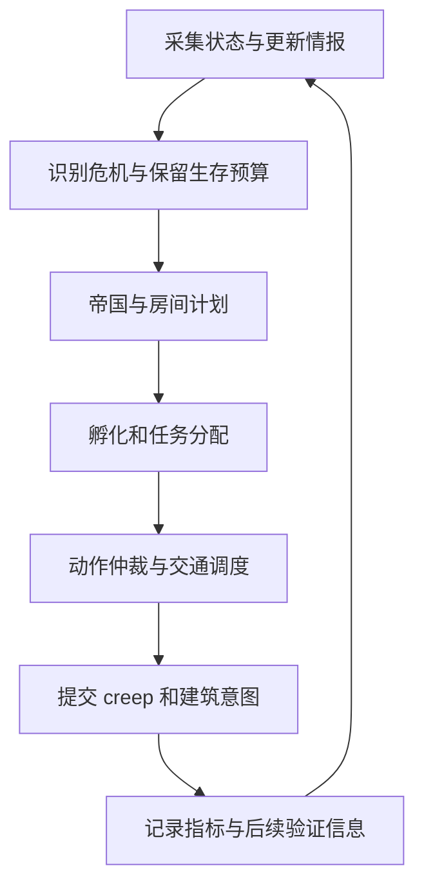

# Screeps: World 全流程自动化开发计划

> 版本：v2.1 · 2026-09-11 · 状态：M0、M1、M2 已完成本地验收，进入 M3（建造、维护与基础防御）；M1 的跨阶段压力场景仍由后续里程碑覆盖。
> 目标：构建能自行生存、发展、作战、扩张和恢复的 AI。完成首次接入后，正常游戏过程不依赖人工摆建筑、设置旗帜、调整角色数量或逐次下达任务。
> 历史实测与旧设计保存在 [v1 归档](docs/PLAN-v1-archive.md)。本文中的里程碑均为新实现的待办，不沿用旧版完成标记。

## 1. 目标、范围与现状

### 1.1 自动化完成的定义

每个系统必须形成以下闭环：**感知状态 → 计算需求 → 分配预算 → 执行 → 验证实际结果 → 补员、重试或调整计划**。只会创建任务、调用 API 或输出日志，不算完成。

必须覆盖：

- 经济：采集、运输、补能、回收、建造、维修、控制器升级、矿物、化合物、生产、交易。
- 人口：身体设计、孵化排队、提前接替、岗位分配、跨房增援、闲置回收。
- 战争：侦察、威胁识别、塔防、机动防御、治疗、撤退、主动攻击、围攻、战后恢复。
- 领土：远程采集、预留控制器、占领、殖民、新房启动、多房资源调度、放弃低收益据点。
- 运维：CPU 降级、缓存重建、Memory 迁移、故障隔离、监控、测试、发布和回滚。

### 1.2 自动化边界

| 类别 | 处理方式 |
|---|---|
| 日常游戏操作 | 由游戏内 AI 自主执行；人工覆盖配置是可选能力，不是运行前提 |
| 战略策略 | 初始提供盟友名单、攻击策略、资源保底和扩张预算等默认值；目标选择和行动时机由 AI 判断 |
| 首次进入世界 | 检测账号状态并生成出生房与 spawn 选址方案；能通过已验证接口完成的步骤交给工具执行，客户端必须完成的操作明确列为一次性接入前置条件 |
| 全部房间与 spawn 丢失 | 游戏内代码无法凭空重新出生；由外部守护程序识别失国、诊断并尝试受支持的重新出生流程；需要客户端交互时明确报告阻塞 |
| CPU、GCL、RCL、权限不足 | 自动等待、缩减规模或切换策略，不持续创建无法执行的任务 |
| 测试与发布 | 构建和验证自动执行；配置好发布目标后自动上传、观测和回滚，受 API 配额约束 |

首次授权、付费解锁、验证码等平台环节不能伪装成已经实现的无人值守能力。游戏 AI 在现有权限和资源内自主运行。

### 1.3 仓库基线

- 当前 `src/main.ts` 为占位入口，游戏逻辑和旧测试夹具已删除，需要重新实现。
- 复用 TypeScript、esbuild、ESLint、Vitest，以及现有 build/typecheck/lint/test/smoke/deploy/watch/stats/whoami/snapshot/engine 命令。
- 本地真实引擎安装脚本保留，自动化场景、逐 tick 驱动和断言需要重建；本地引擎用于测试，实际游戏运行于官方 World。
- 历史记录包含 shard3、W34S1、20 CPU 和约 4 秒/tick；这些是历史观测，实施前重新采集，不能当作当前在线状态。
- 旧文档中的结构上限、CPU 规则、工地通行性、容器衰减和 API 配额有冲突或适用条件。实现使用当前引擎常量、官方接口返回和真实引擎验证；不复制旧结论作为硬编码。

## 2. 总体架构与决策原则

### 2.1 分层

```text
src/
  main.ts                 # 入口与依赖组装
  game/                   # 读取引擎状态、寻路接口、执行意图
  kernel/                 # 调度、CPU、缓存、Memory、日志、指标
  domain/
    economy/              # 收支、储备、产能、资源预算
    population/           # 岗位需求、身体、孵化、接替
    logistics/            # 搬运订单、资源预约、线路
    planning/             # 布局、施工、维修、升级策略
    intel/                # 情报、威胁、路线、目标评分
    combat/               # 防御、攻击、小队、撤退
    expansion/            # 远矿、预留、占领、殖民
    industry/             # 矿物、实验室、工厂、终端、市场、power
  colony/                 # 房间管理与本地系统协作
  empire/                 # 多房预算、资源调拨、跨房行动
test/
  unit/                   # 决策契约
  integration/            # 完整 tick 与快照回放
  scenarios/              # 真实引擎生命周期和故障场景
scripts/                  # 构建、场景运行、发布、监控工具
```

目录随对应里程碑落地，不预先堆空框架。纯决策层只接收数据并返回计划，不读取引擎全局；`game/` 负责落地。M0 同步更新现有 ESLint 例外和导入边界，保证适配层可访问引擎、纯逻辑层不能绕过接口。

### 2.2 调度层级

| 层级 | 决策内容 | 调度原则 |
|---|---|---|
| 帝国 | 扩张、战争、支援、资源分配 | 事件触发 + 低频轮转 |
| 房间 | 收支、补员、施工、升级、防御 | 紧急事件立即处理，普通计划分频执行 |
| 行动 | 远矿、殖民、护送、攻击、运输链 | 明确目标、预算、进展、超时和终止条件 |
| 个体/建筑 | 移动、工作、转运、塔和 link 等结构动作 | 每 tick 处理必要执行 |

建议起始频率：执行和防御每 tick；人口与物流需求每 5–10 tick；经济和维修每 25–100 tick；布局、远矿评估和扩张每 100–1000 tick。关键死亡、敌情、RCL 变化等事件提前唤醒计划；频率根据实测 CPU 调整。



### 2.3 不变式

1. **生存优先**：紧急防御、恢复收入、避免控制器降级必须有保底。紧急任务按预计损失与截止时间仲裁，不能被普通施工、升级、交易或远征耗尽资源。
2. **需求由产能驱动**：按实际可采量、运输周转、孵化占用与净收入计算岗位，避免固定角色比例。
3. **状态可恢复**：global reset、部署、目标消失、房间失去视野后可以重建任务；不重复派出殖民队、不重复采购、不遗失在途资源。
4. **执行有仲裁**：每个单位只有一个最终移动意图；工作和建筑动作按引擎兼容关系合并，防止不同管理器互相覆盖。
5. **结果跨 tick 验证**：API 返回成功只代表意图接受；资源实际转移、结构实际建成、占领实际完成，需要后续可见状态确认。
6. **所有队列有界**：任务、情报、错误、日志、预约、重试均有 TTL、容量或清理机制。
7. **失败可以退出**：目标不可达、亏损、持续高威胁或资源不足时自动暂停、撤退、取消和重新评估。

### 2.4 状态与持久化

房间状态采用 `BOOTSTRAP → DEVELOPING → STABLE`，并可进入 `RECOVERING`、`SIEGE` 或 `EVACUATING`。RCL 决定能力上限；实际人口、基础设施、库存和威胁决定运行状态。允许降级恢复，使用滞回和最短保持时间避免抖动。扩张不要求母房先到 RCL8。

- `Memory`：schema、角色与岗位标识、行动 ID、布局版本、战略状态、必要情报摘要、配置和重试状态。
- global heap：可重建的索引、寻路缓存、派生需求和临时预约；重启后统一重建并消除冲突。
- segments：较大情报、地形、统计历史和诊断，统一分配段号；考虑激活延迟与可用数量，关键行为不能等待某个段才可执行。
- 持久化对象只存 ID 和必要数据，不保存引擎对象引用。对象 ID 失效、视野丢失与目标确认销毁分开处理。

### 2.5 任务依赖、死锁与饥饿恢复

- 任务记录依赖、资源预约、执行者、最后实际进展时间、截止时间和阻塞原因；续租、重复提交意图不算实际进展。
- 对活动任务维护有界依赖图，识别“建造等运输 → 运输等孵化 → 孵化等采集”等循环；普通长期等待按任务类型区分正常积累、不可达和资源死锁。
- 恢复顺序为：释放失效预约 → 更换执行者/来源/目标 → 拆分任务或使用应急身体 → 暂停低优先级消费 → 进入房间恢复模式。保留仍有效的在途交付，避免清理预约后重复派单。
- 为可执行但长期未调度的任务增加等待权重和服务窗口，生存任务仍有保底；无法满足前置条件的任务进入有期限的等待，不靠无限提权强行执行。
- 同一故障使用恢复次数上限和退避；重复失败升级为明确阻塞事件。重启后重建依赖与预约，继续原有恢复进度。

### 2.6 能力发现与配置校验

- 启动、reset、RCL/归属变化及低频复核时生成能力表：CPU、GCL、房间等级、可用建筑、有效部件、power 能力和可见路线；外部工具另行验证 API 权限与发布能力。
- 校验配置类型、范围和关系，包括库存上下限倒置、储备大于有效容量、攻击目标命中盟友、生产目标缺少设施和失效房间引用。
- 无效覆盖项采用明确的有效默认值或停用对应行动，记录原因；不能静默清除生存保底。缺失视野标为未知，不能等同于失去能力。
- 能力恢复后重新评估等待任务；新增能力先通过前置条件再启用。盟友名单和归属情报分开管理，名单配置不能仅因长期未见而自动删除。

## 3. 全流程功能设计

### 3.1 采集与能源经济

- 开局使用可自采、自送的通用工作单位；收入稳定后切换定点矿工与运输分工。
- 为每个 source 选择合法站位和容器位置，按再生周期、可用站位、WORK 产能和搬运能力计算矿工需求。
- 采集端产能受运输瓶颈约束；监测 source 未采尽、容器溢出、掉落损耗与矿工停工原因。
- 记录收入、孵化、运输维护、维修、建设、升级和战争支出；可支配盈余才进入可选项目。
- 为下一个关键岗位接替预留可实际用于孵化的能量；不能仅把 storage 库存视为已准备好。
- 断粮时暂停普通消费，调动可工作的单位自采补能，用当前可负担身体恢复收入；无矿工、无运输工分别提供恢复路径。

### 3.2 人口、身体与孵化

- 以岗位而非固定人数建模：矿点岗位、运输吞吐、补能服务、施工/维修 WORK、升级预算、防御与行动兵力。
- 身体设计考虑当前可用能量、房间容量、地形、道路、负载、工作距离、战斗需求和部件上限。
- 提前接替时间 = 孵化时间 + 到岗时间 + 缓冲；在场但寿命不足的单位不算完整未来产能。
- 多 spawn 协调队列；高优先级请求可以抢占未开始的排队任务，孵化中的 creep 按引擎能力处理。
- 建立滚动孵化时间预算：根据有效寿命与岗位规模估算持续更替占用，并按实际死亡期限排出接替窗口；扣除进行中的孵化、必要接替和应急余量后，才接受扩张或战争订单。
- 同时满足能量和 spawn 时间约束；预测来不及到岗时，选择较短身体、其他房间代孵化或缩减远矿/远征，不能以“库存充足”掩盖孵化饱和。
- 生产、物流断档时立即使用较小可负担身体，避免等待最大身体造成死亡螺旋。
- 无任务单位改派、返回待命位或按收益回收；未知角色先识别能力和归属，不默认计入矿工产能。

### 3.3 运输、补能与交通

- 统一运输订单：来源、目的地、资源、数量、优先级、截止时间和预约量，支持掉落物、墓碑、废墟及各类 store。
- 来源按预计可用量预约、目的地按空余容量预约；防止多个运输工同时取空或送满。
- 服务优先级随状态改变：spawn/extensions 补能、战时 tower、控制器保底和必要维修优先；其后为建设、普通升级、产业与储备调拨。
- 吞吐估算以“需求速率 × 实测往返耗时”为基础，再除以单个运输工有效容量；计入等待、疲劳、装卸和绕路。
- 引入批量装载与截止时间：普通搬运尽量满载，救急补能允许部分装载，避免“必须装满”阻塞生命线。
- 房内主干路线缓存、交叉口让行、矿工固定站位、边界换房、拥堵检测、局部绕行与超时重寻路统一处理。
- 后期接入 link 冷却与损耗、terminal 手续费与冷却、跨房运输及护送；相同资源不能形成反复搬回的订单环。

### 3.4 自动布局与建造

- 根据地形、出口、source、controller、矿物和防御边界选择核心区；兼容已有 spawn 和历史建筑。
- 布局包含 spawn、extensions、tower、storage、terminal、links、labs、factory、道路、容器和防御结构，并预留后续等级空间。
- 矿点容器围绕采集站位；控制器补给围绕升级位；lab 布局验证反应距离；link 按供给/中转/消费用途规划。
- 放置前检查结构数量、工地数量、可建性、关键工作位及 spawn 到资源、控制器和出口的连通性。
- 同时检查当前通行性和计划建筑完工后的通行性，具体工地阻挡规则由引擎验证。
- 分批施工，优先解决当前瓶颈：收入和运输设施 → 紧急防御 → 必要容量 → 升级供给 → 产业与扩张设施。
- 低收入时减少并行工地；工地失效、不可达、占用配额或布局升级时自动回收重排。
- 既有关键建筑迁移采用“替代能力准备 → 校验不中断收入/孵化 → 拆除迁建”；唯一 spawn 的迁移需专门恢复方案，禁止普通布局器直接拆除。

### 3.5 升级与维护

- 升级分为防降级保底和盈余投入；按安全库存与净收入调节 WORK，避免升级抢走补员能量。
- RCL 变化自动解锁设施和身体能力；RCL8 根据实际升级限制控制投入，盈余用于 GCL、其他房间或储备。
- 道路、容器等按衰减和未来线路需求计算维护预算；重要通路按流量决定修复收益。
- 预防性维护按预计失效时刻倒排工期：最新派工时间 = 预计失效时刻 − 排队、取能、到达、维修耗时 − 安全余量。结合所属房间、衰减周期、线路价值和战斗损伤更新预测，不能只用统一血量百分比。
- walls/ramparts 按敌情、关键资产、预计伤害及能源预算设置分级目标，避免无限刷血。
- tower 在防御、治疗和维修间协调；和平期只在弹药储备与能源允许时维修。
- 建筑毁坏自动补建，线路受损自动绕行或修复；灾后先恢复收入、孵化、物流，再恢复普通设施。

### 3.6 情报、侦察与路线

- scout 自动探索邻房，后期 observer 轮转扫描；记录房间归属、预留、资源、出口、威胁、关键建筑和观测时间。
- 情报带时效与可信度；不把失去视野当作房间安全或目标消失。扩张、攻击和高价值运输前复核。
- 路线评分考虑距离、道路、敌方领土、已知敌情、封锁和出口通达性，支持绕路与禁行房间。
- 识别普通中立房、source keeper 房及其他特殊资源环境，按威胁能力启用对应采集方式。
- 维护盟友和中立策略；未知玩家使用默认策略，避免依赖人工逐个设旗。

### 3.7 防御与灾后恢复

- 从敌方有效部件、boost、治疗、距离和关键资产暴露程度评估威胁，不能只按敌人数判断。
- tower 集火与治疗协调，考虑距离衰减和敌方治疗；无可杀目标时保护关键资产并控制耗能。
- 自动补充防守兵和 healer，分配驻守/拦截位置；工人避险、远矿撤回、运输改道。
- 根据攻入核心的预计时间与己方应对能力决定 safe mode；核对可用次数、冷却及其他激活条件，并规划可行的补充流程。
- 多房自动增援；不可守时撤出有价值单位和资源，保留后续重建行动。
- 覆盖核打击预警、按落点和落地时间修筑防护或转移资产；按实际能力处理，不把普通塔防当作核防御。
- 防御结束重新评估威胁，修复、补员、解除运输限制并恢复经济，避免永久停留战时状态。

### 3.8 主动攻击与作战行动

- 自动产生候选目标，按收益、威胁、距离、敌方防御、safe mode、预计兵力与长期经济损失评分。
- 行动流程：`SCOUT → PLAN → MUSTER → TRAVEL → ENGAGE → ASSESS → WITHDRAW/COMPLETE`；补给、boost、集结和治疗能力不足时延期或取消。
- 先实现单兵与简单小队，再实现远程拉扯、近战突击、拆墙、治疗协同及围攻；角色分工基于目标配置。
- 小队使用独立的战斗移动计划，并交给统一动作仲裁提交；支持出口两侧集结、跨房成员同步、疲劳等待、伤员掉队接应和阵型重组。
- 宽阔地形保持攻击/治疗覆盖，狭窄通道切换纵队并在安全位置重组；根据有效 MOVE、受损部件、敌方火力和治疗节奏决定推进、停留或后撤。
- 成员失联、边界反复移动或等待过长时重新侦察、补位或撤退；不让整队无限等待已死亡成员，也不让 healer 为追赶队友独自进入火力区。
- 攻击目标按当前战术选择：危险敌军、治疗单位、tower、spawn、通道和任务资产；遇到无法破防的治疗链不持续送兵。
- 每次远征有孵化、资源、CPU、伤亡和最长持续时间预算，母房生存储备不得被突破。
- 超过损失阈值、路线被切断、情报失效或敌方进入 safe mode 时重新评估、撤退或等待。
- 战后侦察确认成果，回收战利品、回收/改派部队，按扩张策略决定占领；nuker 行动作为后期独立作战能力。

### 3.9 远程采集与扩张

- 远矿收益核算包括往返运输、矿工/运输工/预留者重造、道路容器维护、防守和 CPU 成本。
- 远矿流程：`SCOUT → EVALUATE → RESERVE/SETUP → OPERATE → SUSPEND/ABANDON`；预留仅在收益足够时启用。
- 自动建设必要道路与容器、维持预留和岗位接替；敌情触发撤离，情报确认恢复后再开工。
- 新房候选按资源、布局、距离、邻居、路线、防御和帝国互补性评分，避免只选最近房间。
- 开始占领前检查 GCL 名额、claimer 可达性与寿命、母房净收入、关键岗位接替、CPU 余量和启动预算。
- 殖民流程：`SELECT → VERIFY → CLAIM → SEED → BUILD_SPAWN → STABILIZE → INDEPENDENT`，由母房派工作队与运输支持，直至新房具备自主收入和补员能力。
- 同时限制在建殖民地数量，默认一次一个；房间被抢占、路线封锁、工队死亡时补派、改道或止损。
- 20 CPU 下仍以实测成本评估远矿和新房，不预设“必然不能多房”；持续预算不足时自动缩减规模并报告瓶颈。
- 控制器行动统一管理升级、预留、占领、攻击及可选签名；执行前检查归属、预留者、GCL、有效 CLAIM/WORK、距离、寿命、升级阻断及 safe mode 等实际限制。
- 遇到敌方预留或已占领目标时，按策略选择等待、攻击控制器、改选目标或退出，不能直接重复 claim；归属变化、阻断到期和 safe mode 结束后重新侦察。攻击控制器与后续占领分为独立行动，按引擎规则验证伤害、计时与占领条件。
- 签名只在配置启用且不影响关键工作时执行，不把签名成功作为占领成功的证据。

### 3.10 多房、产业与后期资源

- 多房按资源缺口、生产优势和防御需求分工，统一调度孵化、增援、能源与矿物，保留各房生存库存。
- RCL6 起按能力启用矿物开采、extractor 冷却管理、terminal 与 lab 反应；生产链按库存上下限生成订单。
- boost 从作战/工作岗位需求反推化合物采购、生产、运输和预留；无法及时配齐时使用明确的无 boost 方案或延期。
- 市场自动选择买卖/挂单策略，计入能源手续费、距离、价格上限、credits 保底和订单维护，避免库存反复交易。
- 资金与库存按“现存、在途、已预约、未成交订单”记账；设定周转目标、仓储余量和订单占用预算，避免 credits 或库存被长期挂单锁住。
- 需求取消、配方切换或市场变化时，取消/缩减采购和生产，释放未执行预约；已投产和在途物资按后续用途、存储成本及净售价改派或出售。
- 结合实际成交记录、订单剩余量和手续费核对余额；处理部分成交、订单到期和积压库存，避免把未成交挂单计为收入或重复补单。
- factory 按依赖和实际等级能力生产，避免中间产物耗尽关键储备。
- power bank、deposit 等行动先核算寿命窗口、衰减、战斗/搬运/回收成本，达标才出队。
- Power Creeps、power spawn、ops 与技能调度随账号解锁能力接入；不阻塞基本无人值守。
- 跨 shard 在单 shard 多房稳定后实现：门户情报、有效期、单位交接、InterShardMemory 协议和超时恢复。

### 3.11 战略目标、瓶颈诊断与效果评估

- 房间和帝国维护当前目标、可选投入、阻塞原因和预计收益；从采集利用率、运输等待、孵化占用、维修负债、升级供给及 CPU 余量判断瓶颈。
- 选择能改善当前瓶颈且满足生存约束的项目。例如容器持续溢出先改善运输，spawn 队列满载先缩减岗位负担，不能盲目增加矿工或升级工。
- 输出可解释决策：“未扩张：孵化接替窗口不足”“未升级：必要维修到期”，并注明下次复核或触发条件。
- 对远矿、道路、人口配置、产业和战争记录预算、预测收益、实际收益及机会成本；道路以节省运输/疲劳成本和维护成本比较，战争同时记录任务成果与损失。
- 跨完整补员或生产周期进行滚动评估，区分启动投入、暂时停工与持续亏损；达到预先配置的窗口和阈值后减员、调参、暂停或退出。
- 策略调整有幅度限制、冷却和复核窗口，避免反复开关产业或搬迁人口；先使用可解释规则，不把在线自学习作为基础实现前提。

### 3.12 既有房间与遗留资产接管

- 支持 `DISCOVER → CLASSIFY → ADOPT → STABILIZE → MIGRATE`：盘点实际建筑、单位、工地、资源和控制器状态，再恢复生产，最后优化布局。
- 对自有 creep 按身体、位置、携带资源和已有有效标识推断可用岗位；给接管结果分配稳定 ID，避免 reset 后反复改派。其他玩家单位只参与情报与交通判断。
- 无 Memory、旧 schema、未知角色和旧布局均可进入接管；先保存可读取的诊断信息，再做版本迁移或最小状态重建。
- 现存有效运输与关键建筑继续服务；无效工地和过时布局按 §3.4 渐进回收。接管不能以清空建筑或重建唯一 spawn 为前提。

### 3.13 领土退出与资产撤离

- 退出触发包括持续亏损、不可守、战略替换和 CPU 长期超额；评估撤离成本、替代据点和依赖该房的运输/孵化/产业，再决定是否退出。
- 完整流程：`ASSESS → FREEZE_INVESTMENT → EVACUATE → RECONCILE → RELEASE → VERIFY`。停止新增建设与生产，迁出人员和高价值资源，按成本处理剩余库存、设施及工地，最后释放控制权并验证结果。
- 远矿退出停止预留与补员并清理本方订单；自有房间退出执行控制器放弃前必须完成资产清算，或记录因敌情和截止时间被迫放弃的残留资产。
- 在途运输、市场订单、出生地归属、支援关系与地图路线同步改派或取消；退出状态持久化，reset 后不重复撤离或重新派队投资。
- 仍承担唯一孵化/恢复能力的房间不能被普通收益优化自动放弃；紧急失守进入残局策略，重新评估存续路径。

### 3.14 残局与孤立房间生存

- 母房失去 spawn、所有权或可达路线时，立即复核支援承诺。支援订单必须有来源、预计到达时间和超时，不能无限等待失效母房。
- 孤立房间根据可采资源、工作单位、孵化能量、控制器余量和安全路线选择：本地自救、请求其他房间接管、限时等待或撤离。
- 已占领但尚无 spawn 的殖民地优先保护可工作的启动队，维持控制器并建成 spawn；缺少建设能力时补派队伍，若全帝国也无补派能力则明确报告不可恢复条件。
- 帝国重选支援来源和行动归属，解除失效调拨与产业依赖；孤立期间暂停非必要出口和战争投入，恢复连通后先对账再恢复正常调度。
- 单房可救、局部失守和全灭分开判定；全灭进入 §1.2 的外部恢复流程，不能让游戏内系统持续生成无执行者的救援任务。

## 4. CPU、可靠性与可观测性

### 4.1 CPU 预算

- 以运行时 `Game.cpu.limit`、`tickLimit`、bucket 为输入，预留收尾开销；不能把历史 20 CPU 写死。
- 低预算时优先执行生存、防御、关键孵化和现有工作；暂停布局重算、全图扫描、市场扫描与新扩张。
- 大计算拆成可续跑批次并错峰；跨房轮转防止某间房长期饥饿。
- bucket 高且长期收支平衡时允许受控突发，bucket 低时进入恢复模式。
- 初始容量目标：代表性稳态窗口平均 CPU ≤ limit 的 70%，p95 ≤ limit 的 90%；突发受 tickLimit 限制。超过目标先降频与优化，再评估缩减行动规模。
- 本地引擎墙钟耗时不等于官方计费 CPU；最终容量判断必须依据线上采样。

### 4.2 故障处理

- 按房间、系统和单位隔离异常；关键系统失败触发最小生存行为与告警。
- 目标死亡、被摧毁、归属变化、路径不可达、容量变化、动作失败均有重新规划路径。
- Memory 迁移幂等，跨版本回滚兼容；不能兼容时先阻止激活并报告原因。
- 路径、布局、任务和资源预约全部可失效；重试带退避，避免每 tick 重复昂贵失败。
- 游戏内运行不依赖外部监控在线；外部守护处理断流、崩溃和全灭等游戏内无法自救的情况。

### 4.3 必备指标

| 范围 | 指标 |
|---|---|
| 运行 | CPU 平均/p95/峰值、bucket、Memory 大小、reset、异常与降级次数 |
| 经济 | 采集与交付速率、净收入、可用孵化能量、储备、资源损耗 |
| 人口 | 关键岗位空窗、接替到岗时间、孵化队列等待、有效 WORK/CARRY |
| 物流 | 订单等待、交付成功率、空载率、拥堵时长、容器溢出 |
| 建设维护 | 工地进展、关键结构寿命、维修积压、控制器降级余量 |
| 战争 | 威胁等级、伤亡、资源损失、撤退结果、目标进展 |
| 扩张 | 远矿净收益、殖民启动成本、独立耗时、每房 CPU |
| 自救与接管 | 无进展时长、依赖环数量、饥饿任务数、恢复次数、接管进度、孤立房支援超时 |
| 产能与策略 | spawn 未来占用率、接替截止时间违约、当前瓶颈、预测/实际收益偏差、策略切换次数 |
| 维护与库存 | 预计失效时间、维修到达余量、资金占用、订单剩余量、库存周转和积压时间 |
| 外部守护 | 最近完成 tick、构建版本、观测延迟、心跳失联时长、回滚结果 |

事件日志记录“触发原因、选中动作、预算不足原因”；快照和统计通过现有工具采集。日志去重限流，详细诊断按需开启。需要干预时提供具体阻塞原因，而不是只报“AI 停止”。

### 4.4 外部心跳与执行中断检测

- 游戏内记录最近完成的 tick、构建版本和关键阶段结果，由外部 supervisor 定期采集。持久化采用引擎支持的提交语义，不能假设 CPU 强制终止前的标记一定保存成功。
- 外部结合世界 tick 是否推进、统计更新时间、console 异常和 API 连通性，区分世界暂停、监控断流、入口加载失败、连续 CPU 终止和普通运行异常。
- 超过连续窗口后先重新连接并确认状态；确认代码异常才执行兼容产物回滚。入口完全未运行时也必须能检测，不能依赖游戏内 catch 上报。
- 回滚后验证心跳恢复与关键经济指标；设恢复尝试上限及冷却，防止分支来回切换。权限或配额不足时保留证据并报告具体阻塞。
- M1 定义心跳字段并验证更新，M3 首次持续上线前交付最小外部检测，M9 完成自动恢复与长稳验收。

## 5. 开发里程碑与验收

各阶段按依赖推进；每个阶段都交付能运行的纵向闭环、自动化验证和指标。

| 阶段 | 实施范围 | 依赖 | 完成标准 |
|---|---|---|---|
| **M0 基线与验证底座 ✅** | 重新采集状态；验证脚手架；重建真实引擎场景；锁定规则与 lint 边界 | 无 | **已完成**：线上确认 shard3/20 CPU/empty；Node24+GCC15 引擎安装并验证；fresh/legacy/no-memory 三个场景共 34 项检查通过；失败报告包含版本、bundle hash、逐 tick 状态；能力/配置契约与架构测试通过 |
| **M1 自养闭环 ✅** | 最小内核、采集、交付、孵化、自适应身体、升级保底、接替和断粮恢复 | M0 | **已完成核心验收**：本地 14 项测试、600 tick 恢复、3100 tick 生命周期通过；线上 `shard3/W35S2` 通过 1602 tick 验收：旧 6 单位全部接替、人口最低 4、无心跳断档、错误 0、控制器进度 +1600、实时 CPU 1.11/20。断粮、拥堵、敌袭、多房和全 spawn 丢失属于后续压力场景，不阻止 M1 核心完成 |
| **M2 物流与交通 ✅** | 定点采矿、容器、运输订单、补能、预约、路径缓存、拥堵恢复 | M1 | **已完成本地验收**：600 tick 失效订单恢复 8 项、持续故障终止 15 项、3100 tick 双矿点自动施工 8 项、对向互换 4 项、多消费者公平 2 项、受限 CPU 降级 3 项、跨岗位依赖注入 3 项、封闭窄路/不可达恢复 5 项、多房间公平 5 项检查通过；统一经济任务图接入 haul/build/spawn/upgrade。路径缓存改为逐 tick 引擎寻路语义（见文档）。完整回归 11 个场景变体 69 项检查全绿；默认关闭，详见 [本地验证](docs/M2-local-validation.md) |
| M3 建造、维护与基础防御 | 自动布局、分批施工、维修、动态升级、RCL 解锁、tower、防守兵、避险 | M2 | 从 RCL2 自主发展到 RCL4；受损关键结构可修复；可应对基准入侵并恢复经济，无人工摆工地 |
| M4 侦察与远矿 | 情报、路线、远矿评估、预留、跨房运输、撤离和复工 | M3 | 至少一处远矿跨完整补员周期净收益为正；入侵触发撤离，复核安全后复工 |
| M5 自主殖民与多房 | 候选评分、GCL/CPU 门槛、claimer、启动队、新 spawn、多房支援 | M4 | 自动完成一个新房占领、spawn 建成和独立补员；母房不因扩张崩溃；名额不足时不浪费派兵 |
| M6 成熟经济与产业 | links、storage 调度、terminal、矿物、labs、市场、factory | M3；跨房部分依赖 M5 | 关键资源有保底，生产链和调拨可持续；缺料、订单失败和设施损失后能重新规划 |
| M7 完整攻防 | 战斗评估、小队、治疗、集结、主动攻击、围攻、增援、撤退和灾后重建 | M4；复杂补给依赖 M5/M6 | 在可战胜目标场景完成任务；劣势场景按预算撤退；母房经济与防御储备不被抽干 |
| M8 后期能力 | power、Power Creeps、特殊资源、nuker/核防御、可选跨 shard | M5–M7 和实际解锁能力 | 各已启用能力完成收益/威胁评估到结果验证的闭环，缺少前置条件时正确停用 |
| M9 长期无人值守 | 自动验证发布、监控回滚、全局恢复、容量优化、长稳验证 | M1–M8 的已启用能力 | 完成长期场景和线上观察，无周期性人工补员、摆建筑、解堵或调整配额 |

实施顺序以 M0 → M1 → M2 → M3 为首条主线。基础防御从 M3 开始；M6 的房内产业可在 M5 前按 RCL 解锁实施，M7 的基础战斗可在 M4 后推进，不要求先完成后期产业。

### 5.1 补充能力的阶段归属与验收

本表是上表各阶段的必交付内容；相应条目未通过时，该里程碑不能标记完成。

| 能力 | 实施阶段 | 验收标准 |
|---|---|---|
| 任务死锁与长期饥饿检测（§2.5） | M1 进展与超时；M2 依赖和预约恢复；M5 跨房恢复 | 人工注入循环依赖和长期抢占，在场景期限内恢复可执行任务；无恢复条件时有界退出并说明原因 |
| 自动配置校验与能力发现（§2.6） | M0 定义能力来源；M1 基础校验；M6/M8 扩展能力 | 无效阈值、缺设施、未知视野及能力撤销不产生重复无效行动；能力恢复后自动重新评估 |
| 孵化产能预算（§3.2） | M1 接替窗口；M4 远矿准入；M5 多房；M7 战争预算 | 能量充足但 spawn 饱和时拒绝或改派额外行动，关键岗位接替仍满足场景截止时间 |
| 预防性维护（§3.5） | M3 房内；M4 远矿 | 维修工远离目标时仍能提前出发，基准场景内关键容器/道路不因可预防衰减失效 |
| 战斗通行与阵型（§3.8） | M7 | 通过出口、窄路、疲劳差异、掉队和成员死亡场景；能够重组或撤退，无无限等待 |
| 控制器行动（§3.9） | M4 预留；M5 占领与可选签名；M7 攻击和等待 | 敌方预留、归属变化、阻断和 safe mode 场景按当前引擎规则处理，不能执行时正确等待或退出 |
| 资金与库存周转（§3.10） | M6 | 部分成交、取消需求和积压库存场景完成对账，资金和库存保底不被重复占用 |
| 战略瓶颈诊断（§3.11） | M1 收支诊断；M2 运输；M3 投资；M5 帝国级 | 在采集、物流、孵化与 CPU 分别受限的场景选中对应改善动作，并给出停止其他投入的原因 |
| 长期策略效果评估（§3.11） | M4 远矿；M6 产业；M7 战争；M9 综合 | 预设收益偏差或持续亏损达到窗口后自动缩减/停用，暂时波动不导致频繁切换 |
| 既有房间自动接管（§3.12） | M1 单位与经济；M3 工地与布局；M5 多房 | 无 Memory、旧角色、遗留工地和既有建筑场景恢复收入，保留唯一 spawn，reset 后不重复接管 |
| 领土退出与撤离（§3.13） | M4 远矿关闭；M5 自有房退出；M6 产业清算 | 完成停投、撤离、清算、释放和验证；无孤立预约或返程订单，唯一恢复能力受保护 |
| 残局与孤立生存（§3.14） | M1 本地恢复；M5 多房及未建 spawn 殖民地 | 母房丢失或路线封锁后按期限自救、转援或撤离，不永久等待失效支援 |
| 外部心跳（§4.4） | M1 信号；M3 最小守护；M9 自动恢复 | 入口加载失败和 CPU 终止能被外部发现；世界暂停/网络断流不直接触发错误回滚 |

### 5.2 第一批实施任务

- [x] M0：确认当前源码、线上房间/CPU/分支、引擎安装情况和脚本可用性。
- [x] M0：建立固定地图、初始 spawn、快进 runner、结果断言与失败快照。
- [x] M0：为规则建立版本化来源，验证移动疲劳、动作结算、结构上限和施工通行性。
- [x] M0：定义能力表、配置 schema 与冲突处理，准备既有房间和无 Memory 接管夹具。
- [x] M0：实现首次出生房选择器：从推荐区域中心扫描普通房间，以 source、地形距离与核心空间评分并选择 spawn 坐标，生成报告；默认只读，`--execute` 重新验证后调用 `gamePlaceSpawn`。2026-09-11 只读实测 12 房，推荐 W35S2 (24,20)；出生变更接口尚未执行，留待用户运行。邻居威胁和扩张潜力评分随 M4 情报系统完善。
- [x] M1：实现快照/意图接口、最小 CPU 调度、关键状态和统计。
- [x] M1：实现通用工作单位与“采集 → 交付 → 孵化 → 升级保底”完整路径。
- [x] M1：实现岗位寿命预测、低能量身体与紧急恢复，跑通 3000-tick 生命周期。
- [x] M1：接入孵化时间预算、任务无进展检测、瓶颈诊断、旧单位接管与心跳字段。
- [x] M2：依据结果加入定点矿工、运输订单和交通管理。统一移动仲裁、对向互换引擎探针、600 tick 恢复、3100 tick 自动施工回归、封闭窄路/不可达交通恢复（`--traffic-recovery` 探针 5 项检查，`src/game/traffic.ts` 主寻路回归引擎 findPathTo 语义 + 封死目标驻停与有界退避）已通过。
- [x] M2：实现任务依赖环检测、预约恢复和饥饿调度。运输订单依赖环、有限退避和连续三次故障终止通过 600 tick 引擎场景 15 项检查；运输消费者等待权重与有限服务窗口接入，2000 tick 领域竞争与 600 tick 多消费者引擎竞争通过；haul/build/spawn/upgrade 四类岗位统一为运行时经济任务图，跨岗位依赖注入释放通过引擎探针，孵化等待超时按可负担体型触发应急出生；CPU 预算压至 10 的降级场景验证不饥饿、等待有界；多房间公平验收（每房间任务记忆命名空间隔离，`--multi-room` 探针 5 项检查：双房间 owned、人口、双控制器进度、双房间出生、任务记忆互不覆盖）。
- [x] M3：容器维修纵切（§3.5 预防性维护起步）。`src/domain/maintenance.ts` 纯决策（urgent<25% 抢占、0.8 入队阈值、稳定排序），`runLogistics` 接线：非紧急保留 2 工人生存地板、urgent 暂停工地施工、空载修理工先取能、失效/痊愈目标无条件释放。56→60 项单测通过；引擎物理级维修证据由 `test:maintenance` 提供（见引擎回归行）。
- [x] M3：extension 自动布局（RCL 解锁自主发展起步）。`src/domain/planning.ts` 环形扫描（range≥2 不封 spawn 出口、确定性排序、跳过占位、越界裁剪）+ `preservesConnectivity` 割点守卫（候选格的可达邻格在候选被占用后必须互达，否则跳过——extension 工地自放置起即为障碍，复刻 v1「工地封路」缺陷类的防线）；`runLogistics` 每 tick 至多铺 1 个 extension 工地直至 `CONTROLLER_STRUCTURES` 上限；施工循环从容器工地泛化为全部工地且容器优先，`containerSite` 记忆字段语义不变。bootstrap 双 WORK 身体触发保持容器工地专属，避免扰动 M2 已录制时间线。
- [x] M3：tower 基础防御纵切（§3.7 起步）。`src/domain/defense.ts` 纯决策（threatScore = 伤害潜力×接近度， unarmed scout 非威胁；towerTargets 按威胁排序聚焦集火）；`src/game/defense.ts` 接线：塔优先集火最高威胁 → 治疗最重伤 own creep → 参与关键结构维修（无目标不空射；维修不含 wall/rampart）。tower 能量一律读 `store`（`tower.energy` 已弃用）。接线在 bootstrap 房间循环最前（生存优先，不占 creep 人力）。已知事实修正：本引擎 tower 于 **RCL3** 解锁（CONTROLLER_STRUCTURES.tower[2]=0, [3]=1）。
- [x] M3 防御引擎回归：`test:defense`（RCL3 种子 + 满能量 tower + Invader raider 20 体 + 150/300 受伤 worker：塔集火击杀 raider、耗能 1000→960、治疗 worker 150→300、无友伤）+ 全 17 场景变体 **128/128 检查全绿**（含 11 个 M2 既有变体 + maintenance + defense + 三厂）。defense 单测 6 项（threat 排序/聚焦/不空射/治疗/维修）。
- [x] M3 引擎回归（darwin-arm64 本地引擎，Node v24.21.0 + clang；`engine-setup.sh` 已跨平台化，isolated-vm 6.2.0 预编译 + `-include exception` 兜底）：`test:maintenance`（RCL2 种子 + 60% 受损容器：维修跨过种子血线、泛化 builder 推进遗留 extension 工地、环形规划器落新工地）+ 16 个场景变体 **116/116 检查全绿**（含 11 个 M2 既有变体、三厂 fresh/legacy/no-memory）。回归暴露并修复两处真实缺陷：①builder 泛化后 3 工人房间双 builder 抢占升级/矿位（`--multi-room` 抓出：W0N2 controller 0 进度）——容器工地保留 2 工人生存地板，extension 等成长工地改为「真盈余」施工：仅在维修/采矿/搬运全部认领后由空闲工人承建（`--logistics-construction` 曾抓出 source B 容器 0 能量，即 ext 工地吞噬矿位），且 extension 铺设/施工以「双源容器就位」为先决、urgent 维修期间暂停。新增 `test:maintenance` 命令。

## 6. 自动化验证与发布

### 6.1 验证层

1. **静态门禁**：typecheck、lint、build，验证适配边界与产物导出。
2. **决策契约测试**：预算不超支、岗位接替、资源预约、状态迁移、目标评分、行动终止；避免只测试字段复制。
3. **集成回放**：真实快照通过完整 tick，检查目标失效、reset、任务冲突、异常隔离和返回码处理。
4. **真实引擎场景**：推进移动、采集、运输、施工、伤害、衰减、死亡和补员，断言实际结果。
5. **线上观测**：核验真实 CPU、对手行为、长周期收益和实际账号能力；离线通过不等于线上容量已达标。

### 6.2 必测场景矩阵

| 场景 | 必须验证的结果 |
|---|---|
| 开局低能量、无容器、不同矿点距离 | 自动建立收入与升级保底 |
| 矿工全死 / 运输工全死 / 关键 creep 同时到寿 | 在有可恢复资源或可工作单位时恢复产能；无恢复条件时明确失国/求援 |
| 控制器接近降级、能量不足 | 保底任务得到预算，普通消费者退让 |
| 满仓、空仓、工地上限、目标被毁 | 不死锁，任务取消或重新分配 |
| 狭窄通道、静止单位、对向交通、换房 | 无无限振荡，能让行、绕路或报告不可达 |
| reset、部署、Memory 迁移、segment 未激活 | 恢复关键工作，无重复战略行动和资源支出 |
| CPU 压力、低 bucket、多房同时请求重算 | 保留必要执行，低频工作最终得到调度 |
| 入侵、治疗敌军、远矿袭击、不可守围攻 | 防守或撤退合理，战后自动修复与复工 |
| 占领失败、claimer 超时、殖民队死亡 | 有界重试或止损，母房保留生存能力 |
| 生产缺料、市场价格突变、terminal 冷却 | 不突破库存/credits 保底，不重复下单 |
| 循环依赖、重复续租但无进展、任务长期被抢占 | 识别真实停滞，在期限内恢复或明确退出；必要任务获得执行窗口 |
| 能量充足但孵化队列饱和 | 缩小身体、跨房代孵化或拒绝新行动，保留关键接替时间 |
| 无 Memory、旧 schema、未知自有角色、遗留工地 | 接管有效资产，恢复生产，不拆唯一 spawn，不反复改派 |
| 分别限制采集、运输、孵化、CPU；短期与长期亏损 | 诊断正确瓶颈；达到预设评估窗口后调节策略，无频繁反转 |
| 远端容器即将衰减、维修工尚未出发 | 按到达和修复耗时提前派工；不足以挽救时选择补建或改线 |
| 配置上下限倒置、盟友冲突、建筑或权限不可用 | 配置错误可解释，关键默认值有效，能力变化后重新调度 |
| 敌方预留、控制器归属变化、攻击阻断、safe mode | 等待、攻击、占领或退出符合引擎规则，无无效重复派兵 |
| 小队跨房、窄道、疲劳不一致、healer 掉队、成员死亡 | 成功重组或按战术撤退，无成员无限等待和边界振荡 |
| 母房被毁、支援超时、殖民地无 spawn、路线封锁 | 转援、自救或撤离；无恢复能力时报告具体条件 |
| 远矿/自有房退出中 reset、尚有运输和市场订单 | 继续撤离并对账，资源和人员有去向，无重复投资与遗留依赖 |
| 订单部分成交、需求取消、生产中断、库存积压 | 释放未执行预约，核对实际成交，处理在途/已投产资源 |
| 入口加载失败、CPU 强制终止、世界暂停、监控断流 | 外部守护正确区分原因；只对确认的代码故障执行兼容恢复 |

快速场景进入提交门禁；至少 3000 tick 的生命周期场景用于人口和经济变更；夜间执行多地图、多种子长稳场景。RCL 高阶能力可用对应等级初始夹具验证，但不能以此替代从低等级连续发展的验收。

外部守护、市场成交和账号权限等无法由本地世界引擎完整提供的行为，使用协议夹具、故障注入和可用线上接口验证；报告中区分模拟通过与线上实测。

### 6.3 验收指标口径

- 固定地图、初始资源、敌军配置、种子和代码版本，报告初值、终值和关键窗口。
- 初始参考场景中关键矿点产能空窗目标 ≤ 60 tick；长距离远矿根据实际孵化与到岗时间建立单独阈值，并通过提前接替缩短空窗。
- 远矿净收益计算至少覆盖完整岗位更替周期，包含已投入道路、容器、防卫及重造成本；报告回本时间，避免只看毛采集量。
- 每个压力场景指定恢复期限、可接受损失和失败条件，运行前固定，不在失败后随意放宽。
- 失败自动保存地图、实体、Memory、资源曲线、角色状态和随机种子，可重复执行。
- M9 初始目标：离线至少 20000 tick 长稳场景通过，并完成至少 7 天线上观察；期间无例行人工干预，关键任务无永久饥饿，CPU/bucket 无持续恶化。记录期间版本变化，变更后重新观察受影响指标。

### 6.4 自动发布闭环

目标流水线：`变更 → 静态检查 → 契约/回放测试 → 相关真实引擎场景 → build/smoke → 产物哈希 → 配额检查 → 上传/激活 → 健康观察 → 保持或回滚`。

- 复用现有脚本，新加场景执行、统一 verify、release 与外部 supervisor；这些是待实现能力，不能假定现有 `deploy` 已提供。
- 避免无变更上传，合并短时间连续变更；按端点独立记账，处理 429 与重置时间，预留故障回滚额度。
- 保留已知可用产物、分支、配置和 schema 兼容信息；按当前 World 单一激活分支语义发布。
- 按房间/功能开关逐步启用新能力；检测异常激增、收入崩溃、关键岗位长期缺失或 CPU 失控，达到连续窗口阈值才自动回滚。
- 回滚失败、配额耗尽和监控断流分别处理；不能把“没有监控数据”判定为健康。
- 发布与监控使用环境中的凭据，不把 token 写入计划、测试夹具或日志。

## 7. 最终交付与完成条件

- [ ] 游戏 AI：采集、运输、建造、升级、维护、攻防、扩张和恢复均有完整闭环。
- [ ] 账号当前可用的产业与后期能力可自主启用；未解锁能力有明确前置条件和验证场景。
- [ ] 无人工旗帜、固定角色配额、手工摆工地或定时控制台修补的正常运行依赖。
- [ ] 自动化测试可重现关键物理与经济故障，长稳结果有证据。
- [ ] 发布、观测、故障诊断与可兼容版本回滚形成自动化流程。
- [ ] 任务死锁、调度饥饿和孵化饱和可检测并恢复，关键岗位获得资源与时间双重保底。
- [ ] 既有资产可自动接管，孤立房间和失效支援可自救或退出，领土放弃完成资产与订单清算。
- [ ] 瓶颈诊断与收益评估能调整投入；能力校验、预防性维护、库存周转和战斗阵型通过对应场景。
- [ ] 外部心跳能发现游戏内无法上报的中断，恢复过程有验证、上限和故障证据。
- [ ] 提供配置说明、架构说明、指标口径和故障恢复说明，区分“自动恢复”“资源不足等待”“平台操作阻塞”。

**交付优先级：先保证可持续自养和恢复，再提高经济效率与基础防御，然后实现远矿、多房、产业和主动战争，最后完成后期能力与长期无人值守验收。**
